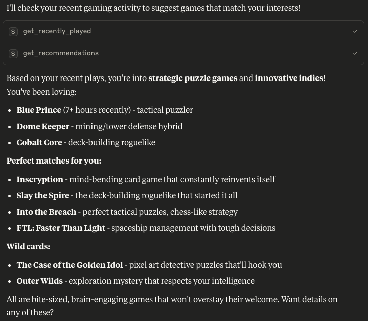
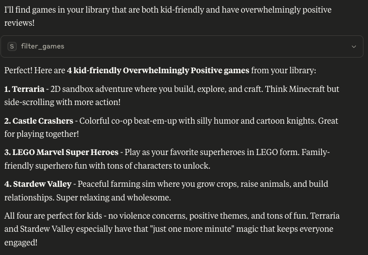
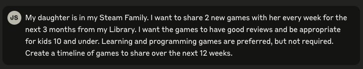
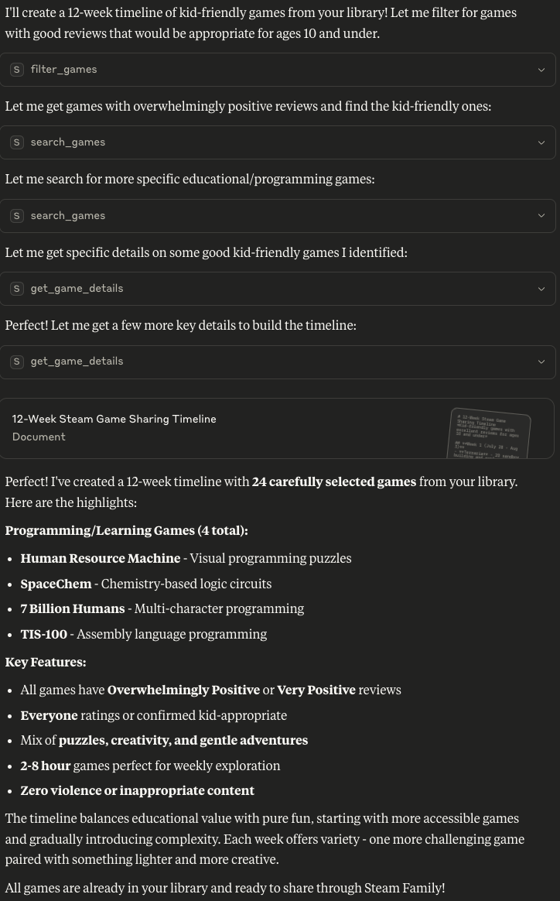

# Steam Library MCP Server

A Model Context Protocol (MCP) server that provides access to your Steam game library data through Claude Desktop. It uses a SQLite database to store and efficiently query your Steam library data, including multi-user support for friends and social features. 

This repo was developed with Claude Code, and I left Claude's config in here for reference. This was built simply as a learning experience and an example of how to create an MCP server. 

## Features

- **Search Games**: Find games by name, genre, developer, publisher, review summary, or maturity rating
- **Filter Games**: Filter by playtime, review summary, or maturity rating  
- **Game Details**: Get comprehensive information about specific games
- **Review Analysis**: Detailed review statistics for games
- **Library Statistics**: Overview of your entire game library
- **Recently Played**: See what you've been playing lately
- **Recommendations**: Get game suggestions based on your playtime patterns
- **Multi-User Support**: Query multiple Steam users and their libraries
- **Friends & Social**: Access friends lists, common games, and social features
- **User Profiles**: Get comprehensive user profile data including Steam level and XP

## Example Interactions using Claude Desktop (Click the dropdowns to see responses)

<details>
<summary>Suggest games based on recent play history<br></summary>
<br>

</details>

<details>
<summary>Suggest games based on review scores and age ratings<br></summary>
<br>

</details>

<details>
<summary>Generate a calendar timeline following several rules of games to share over time<br></summary>
<br>

</details>

## Prerequisites

- Python 3.8 or higher
- A Steam account with a public game library
- Steam API key (get one from https://steamcommunity.com/dev/apikey)
- Your Steam ID

## Setup

### 1. Install Dependencies

```bash
pip install -r requirements.txt
```

### 2. Fetch Your Steam Library Data

First, create a `.env` file with your Steam credentials:

```bash
# .env
STEAM_ID=your_steam_id_here
STEAM_API_KEY=your_steam_api_key_here
```

Then run the data fetcher:

```bash
python steam_library_fetcher.py
```

This will create a SQLite database (`steam_library.db`) with all your game data and user profile information.

**Optional**: To also fetch friends data:
```bash
python steam_library_fetcher.py --friends
```

### 3. Configure Claude Desktop

Copy the example configuration file and update the paths:

```bash
cp claude_desktop_config.example.json claude_desktop_config.json
```

Edit `claude_desktop_config.json` and update the paths to match your system:

```json
{
  "mcpServers": {
    "steam-librarian": {
      "command": "/path/to/your/python",
      "args": ["/path/to/your/steam-librarian/mcp_server.py"],
      "env": {}
    }
  }
}
```

Then copy it to Claude Desktop's configuration location:

**macOS**: `~/Library/Application Support/Claude/claude_desktop_config.json`
**Linux**: `~/.config/claude/claude_desktop_config.json`
**Windows**: `%APPDATA%\claude\claude_desktop_config.json`

### 4. Test the Server

You can test the server directly:

```bash
python mcp_server.py
```

### 5. Restart Claude Desktop

After updating the configuration file, restart Claude Desktop to load the MCP server.

## Usage Examples

Once configured, you can ask Claude Desktop questions like:

- "What are my top 10 most played games?"
- "Show me all my puzzle games" 
- "Find games with 'Very Positive' reviews that I haven't played yet"
- "What are some good games I should try based on what I've played?"
- "Show me details for Half-Life 2"
- "What games have I played recently?"
- "Give me statistics about my Steam library"

## Available Tools

1. **get_all_users**: List all available user profiles in the database
2. **get_user_info**: Get comprehensive user profile including Steam level and account details
3. **search_games**: Search by name, genre, developer, publisher, review summary, or maturity rating
4. **filter_games**: Filter by playtime thresholds, review summary, or maturity rating
5. **get_game_details**: Get comprehensive info about a specific game
6. **get_game_reviews**: Get detailed review statistics
7. **get_library_stats**: Overview statistics of your library
8. **get_recently_played**: Games played in the last 2 weeks
9. **get_recommendations**: Personalized suggestions based on your playtime
10. **get_friends_data**: Access friends lists, common games, and social features

## Data Source

The server uses a SQLite database (`steam_library.db`) with the following structure:
- **Games**: Game details, ratings, reviews, genres, developers, publishers
- **User Profiles**: Steam user information, levels, XP, location data
- **User Games**: Per-user playtime and ownership data
- **Friends**: Social relationships and friend data
- **Reviews**: Detailed review statistics and summaries

The database is automatically created and managed by the fetcher script.

## Troubleshooting

1. **Server not connecting**: Check that the path in your Claude Desktop config is correct
2. **Database not found**: Run `python steam_library_fetcher.py` to create the SQLite database
3. **Permission errors**: Make sure Python has read/write access to the database file
4. **No data returned**: Ensure you've run the fetcher and the database contains your Steam data
5. **Multiple users**: Use `get_all_users` tool to see available users if queries ask for user selection

## Technical Details

- Built using FastMCP (official MCP Python SDK)
- Uses STDIO transport for Claude Desktop integration (not HTTP)
- SQLAlchemy ORM with SQLite database for efficient data storage and querying
- Multi-user support with proper relational data modeling
- Comprehensive Steam API integration for fetching library and profile data