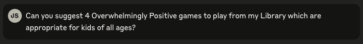

<p align="center">
  
</p>

# Steam Library MCP Server

<p align="center">
  <a href="https://opensource.org/licenses/MIT"></a>
  <a href="https://www.python.org/downloads/"></a>
  <a href="https://hub.docker.com/r/jimsantora/steam-librarian"></a>
  <a href="https://kubernetes.io/"></a>
  <a href="https://github.com/anthropics/mcp"></a>
</p>

A Model Context Protocol (MCP) server that provides access to your Steam game library data through an HTTP API. It uses a SQLite database to store and efficiently query your Steam library data, including multi-user support for friends and social features. 

This repo was developed with Claude Code, and I left Claude's config in here for reference. This was built simply as a learning experience and an example of how to create an MCP server. 

## Features

- **Search Games**: Find games by name, genre, developer, publisher, review summary, or maturity rating
- **Filter Games**: Filter by playtime, review summary, or maturity rating  
- **Game Details**: Get comprehensive information about specific games
- **Review Analysis**: Detailed review statistics for games
- **Library Statistics**: Overview of your entire game library
- **Recently Played**: See what you've been playing lately
- **Recommendations**: Get game suggestions based on your playtime patterns
- **Multi-User Support**: Query multiple Steam users and their libraries
- **Friends & Social**: Access friends lists, common games, and social features
- **User Profiles**: Get comprehensive user profile data including Steam level and XP

## Example Interactions (Click the dropdowns to see responses)

<details>
<summary>Suggest games based on recent play history<br></summary>
<br>

</details>

<details>
<summary>Suggest games based on review scores and age ratings<br></summary>
<br>

</details>

<details>
<summary>Generate a calendar timeline following several rules of games to share over time<br></summary>
<br>

</details>

## Prerequisites

- Python 3.8 or higher
- A Steam account with a public game library
- Steam API key (get one from https://steamcommunity.com/dev/apikey)
- Your Steam ID

## Setup

### 1. Install Dependencies

```bash
pip install -r requirements.txt
```

### 2. Fetch Your Steam Library Data

First, create a `.env` file with your Steam credentials:

```bash
# .env
STEAM_ID=your_steam_id_here
STEAM_API_KEY=your_steam_api_key_here
```

Then run the data fetcher:

```bash
python src/fetcher/steam_library_fetcher.py
```

This will create a SQLite database (`steam_library.db`) with all your game data and user profile information.

**Optional**: To also fetch friends data:
```bash
python src/fetcher/steam_library_fetcher.py --friends
```

### 3. Run the MCP Server

Start the HTTP server:

```bash
python src/mcp_server/mcp_server.py
```

The server will start on `http://0.0.0.0:8000/mcp`.

### 4. Verify the Server is Running

The server will output logs indicating it's running on `http://0.0.0.0:8000/mcp`.

You can also check the health endpoint:
```bash
curl http://localhost:8000/health
```

## Usage Examples

The MCP server provides tools that can answer questions like:

- "What are my top 10 most played games?"
- "Show me all my puzzle games" 
- "Find games with 'Very Positive' reviews that I haven't played yet"
- "What are some good games I should try based on what I've played?"
- "Show me details for Half-Life 2"
- "What games have I played recently?"
- "Give me statistics about my Steam library"

## Available Tools

1. **get_all_users**: List all available user profiles in the database
2. **get_user_info**: Get comprehensive user profile including Steam level and account details
3. **search_games**: Search by name, genre, developer, publisher, review summary, or maturity rating
4. **filter_games**: Filter by playtime thresholds, review summary, or maturity rating
5. **get_game_details**: Get comprehensive info about a specific game
6. **get_game_reviews**: Get detailed review statistics
7. **get_library_stats**: Overview statistics of your library
8. **get_recently_played**: Games played in the last 2 weeks
9. **get_recommendations**: Personalized suggestions based on your playtime
10. **get_friends_data**: Access friends lists, common games, and social features

## Data Source

The server uses a SQLite database (`steam_library.db`) with the following structure:
- **Games**: Game details, ratings, reviews, genres, developers, publishers
- **User Profiles**: Steam user information, levels, XP, location data
- **User Games**: Per-user playtime and ownership data
- **Friends**: Social relationships and friend data
- **Reviews**: Detailed review statistics and summaries

The database is automatically created and managed by the fetcher script.

## Troubleshooting

1. **Server not connecting**: Check that the server is running on the correct port
2. **Database not found**: Run `python src/fetcher/steam_library_fetcher.py` to create the SQLite database
3. **Permission errors**: Make sure Python has read/write access to the database file
4. **No data returned**: Ensure you've run the fetcher and the database contains your Steam data
5. **Multiple users**: Use `get_all_users` tool to see available users if queries ask for user selection

## Technical Details

- Built using FastMCP (official MCP Python SDK)
- Uses HTTP transport with streamable responses
- SQLAlchemy ORM with SQLite database for efficient data storage and querying
- Multi-user support with proper relational data modeling
- Comprehensive Steam API integration for fetching library and profile data
- RESTful API endpoints for MCP tool invocation

## Project Structure

```
steam-librarian/
├── src/                      # Source code
│   ├── fetcher/             # Steam library data fetcher service
│   │   └── steam_library_fetcher.py
│   ├── mcp_server/          # MCP server service
│   │   └── mcp_server.py
│   └── shared/              # Shared code between services
│       └── database.py      # SQLAlchemy models and DB utilities
├── deploy/                  # Deployment configurations
│   ├── docker/             # Docker configurations
│   │   ├── Dockerfile.fetcher
│   │   ├── Dockerfile.mcp_server
│   │   └── docker-compose.yml
│   └── helm/               # Helm charts
│       └── steam-librarian/
│           ├── Chart.yaml
│           ├── values.yaml
│           └── templates/
├── docs/                   # Documentation
├── images/                 # Images and assets
├── requirements.txt        # Python dependencies
├── .env.example           # Environment variables template
└── README.md              # Main project documentation
```

### Service Architecture

- **Fetcher Service**: Runs as a CronJob in Kubernetes, fetches Steam data via API
- **MCP Server**: Runs as a Deployment, provides MCP interface to Steam data
- **Shared Storage**: SQLite database on persistent volume shared between services

## Deployment Options

### Local Development
```bash
# Run directly with Python
python src/mcp_server/mcp_server.py
```

### Docker
```bash
# Build and run with Docker Compose
make build-docker
make run-docker

# Stop services
make stop-docker
```

### Kubernetes with Helm
```bash
# Create values override file
cp deploy/helm/steam-librarian/values.yaml deploy/helm/steam-librarian/values-override.yaml
# Edit values-override.yaml with your Steam credentials

# Install with Helm
helm install steam-librarian deploy/helm/steam-librarian -f deploy/helm/steam-librarian/values-override.yaml

# Manual data fetch (since startup job was removed)
kubectl create job --from=cronjob/steam-librarian-fetcher manual-fetch-$(date +%s)
```

## Using the MCP Server

This MCP server uses the Model Context Protocol, which requires an MCP client to interact with it. The server exposes tools that can be called by MCP clients such as:

- Claude Desktop (with appropriate configuration)
- MCP-compatible AI assistants
- Custom MCP clients using the MCP SDK

The server runs on port 8000 by default with the following endpoints:
- `http://0.0.0.0:8000/mcp` - MCP protocol endpoint (HTTP transport with SSE)
- `http://0.0.0.0:8000/health` - Health check endpoint for monitoring

### Available MCP Tools

The server exposes these tools through the MCP protocol:
- `get_all_users` - List all Steam users in the database
- `search_games` - Search games by name, genre, developer, etc.
- `filter_games` - Filter games by playtime, reviews, or rating
- `get_game_details` - Get detailed information about a specific game
- `get_game_reviews` - Get review statistics for a game
- `get_library_stats` - Get overall library statistics
- `get_recently_played` - Get recently played games
- `get_recommendations` - Get personalized game recommendations
- `get_user_info` - Get user profile information
- `get_friends_data` - Get friends and social data